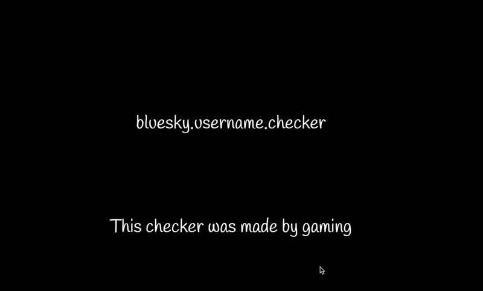

<h1>bluesky.username.checker</h1>
⚠️このチェッカーは自分がturbowarpで作成したものをpackager.turbowarp.orgでhtmlに変換したものです。⚠️ 
変化する部分の文字はX、Y、Z、Wを使って入力してください。 
毎秒300回以上チェックすると429が出ます。 
allはアルファベットと数字と"-"、letterはアルファベット、numberは数字です。 
チェックし終わるとtxtファイルとして未作成リストを保存できます。 
<h1>使用したAPI</h1>
https://public.api.bsky.app/xrpc/com.atproto.identity.resolveHandle?handle={username}.bsky.social  
※{username}のところがユーザーネームを入力する部分です。
<h1>使用例</h1>

  

  
<h1>Download</h1>
https://github.com/qwrfz/bluesky.username.checker/raw/refs/heads/main/bluesky.username.checker-v4.0.sb3
