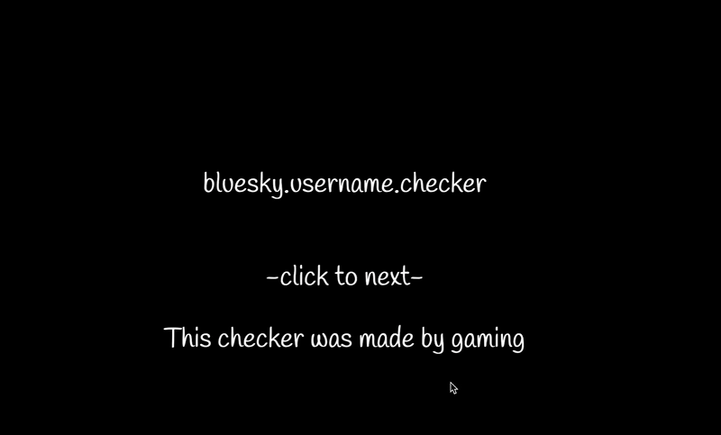

<h1>bluesky.username.checker</h1>
⚠️このチェッカーは自分がturbowarpで作成したものをpackager.turbowarp.orgでhtmlに変換したものです。⚠️
変化する部分の文字はX、Y、Z、Wを使って入力してください。
毎秒300回以上チェックすると429が出ます。
allはアルファベットと数字と"-"、letterはアルファベット、numberは数字です。
チェックし終わるとtxtファイルとして未作成リストを保存できます。
<h1>使用したapi</h1>
https://public.api.bsky.app/xrpc/com.atproto.identity.resolveHandle?handle={username}.bsky.social
※{username}のところがユーザーネームを入力する部分です。
<h1>使用例</h1>

  

